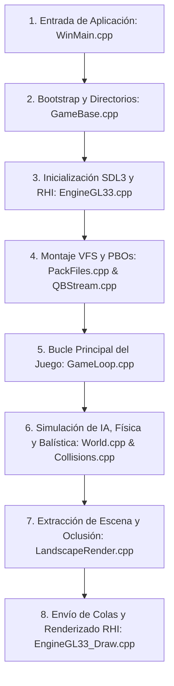

# Anatomía y Arquitectura del Motor RVAS-Engine

Este documento proporciona una guía detallada de la arquitectura del repositorio [RVAS-Engine](../), un motor de bajo nivel moderno basado en el código CWR / Real Virtuality 1 (Poseidon) de Bohemia Interactive. El motor utiliza **C++20**, **CMake Presets**, **vcpkg** (Modo Manifiesto), **SDL3** y **OpenGL 4.5/3.3 Core (GLAD)**.

---

## Índice
* [1. Mapeo de Directorios (Aislamiento Motor vs. Juego)](#1-mapeo-de-directorios-aislamiento-motor-vs-juego)
* [2. Ruta de Lectura Crítica (Reading Path)](#2-ruta-de-lectura-crítica-reading-path)
* [3. Puntos Calientes de Arquitectura y Portabilidad](#3-puntos-calientes-de-architectura-y-portabilidad)
* [4. Subsistemas Avanzados del Motor (Memoria, Scripting y Concurrencia)](#4-subsistemas-avanzados-del-motor-memoria-scripting-y-concurrencia)
* [5. Validación del Stack y Flujo Lineal de Lectura del Código](#5-validación-del-stack-y-flujo-lineal-de-lectura-del-código)
* [6. Guía Didáctica del Motor Gráfico y RHI (para Principiantes)](#6-guía-didáctica-del-motor-gráfico-y-rhi-para-principiantes)
* [7. Guía Didáctica del Bucle de Juego y Simulación (para Principiantes)](#7-guía-didáctica-del-bucle-de-juego-y-simulación-para-principiantes)

---

## 1. Mapeo de Directorios (Aislamiento Motor vs. Juego)
[🔼 Volver al Índice](#índice)

A diferencia de los motores comerciales modernos (donde el motor se compila como una DLL/Librería estática independiente y el juego importa sus cabeceras), el código de Real Virtuality 1 presenta un acoplamiento histórico donde la lógica de simulación táctica del juego y la infraestructura del motor coexisten en el mismo árbol de directorios de `engine/Poseidon`. Sin embargo, la inicialización y el punto de entrada de la plataforma se mantienen aislados en `apps/cwr`.

### El Motor (Real Virtuality 1 / Poseidon)
La infraestructura pura del motor está distribuida en los siguientes submódulos:
* **[engine/Poseidon/Core/](../engine/Poseidon/Core)**: Control de ciclo de vida principal y bucle de juego básico. Contiene [Application.hpp](../engine/Poseidon/Core/Application.hpp) y el gestor del bucle principal [GameLoop.cpp](../engine/Poseidon/Core/Game/GameLoop.cpp).
* **[engine/Poseidon/Foundation/](../engine/Poseidon/Foundation)**: Utilidades de bajo nivel, librerías matemáticas vectoriales ([Math3DK.hpp](../engine/Poseidon/Foundation/Math/Math3DK.hpp)), gestores de memoria, logging y el manejador de fallos ([CrashHandler.hpp](../engine/Poseidon/Foundation/Platform/CrashHandler.hpp)).
* **[engine/Poseidon/Graphics/](../engine/Poseidon/Graphics)**: La interfaz abstracta de renderizado (RHI - Render Hardware Interface). Define el contrato base [IGraphicsEngine.hpp](../engine/Poseidon/Graphics/IGraphicsEngine.hpp) y la clase base intermedia [Engine.hpp](../engine/Poseidon/Graphics/Core/Engine.hpp).
* **[engine/PoseidonGL33/](../engine/PoseidonGL33)**: Implementación concreta de la RHI en OpenGL 4.5/3.3 Core utilizando SDL3 y GLAD. Aquí se encuentran la creación del contexto gráfico ([EngineGL33.cpp](../engine/PoseidonGL33/EngineGL33.cpp)), compiladores de shaders ([EngineGL33_Shaders.cpp](../engine/PoseidonGL33/EngineGL33_Shaders.cpp)) y manejadores de buffers de vértices ([EngineGL33_VertexBuffer.cpp](../engine/PoseidonGL33/EngineGL33_VertexBuffer.cpp)).
* **[engine/Poseidon/IO/](../engine/Poseidon/IO)**: Sistema de archivos virtual (VFS) y deserialización de flujos comprimidos. Administra los archivos PBO ([PackFiles.cpp](../engine/Poseidon/IO/PackFiles.cpp)) y streams binarios ([QBStream.cpp](../engine/Poseidon/IO/Streams/QBStream.cpp)).
* **[engine/Poseidon/Input/](../engine/Poseidon/Input)**: Abstracción de periféricos mediante llamadas directas de SDL3.
* **[engine/PoseidonOpenAL/](../engine/PoseidonOpenAL)**: Backend concreto para el sistema de audio posicional 3D sobre OpenAL.
* **[engine/PoseidonFormats/](../engine/PoseidonFormats)**: Capa unificada para lectura de recursos del motor en formato nativo ([PoseidonFormats.cpp](../engine/PoseidonFormats/PoseidonFormats.cpp)).

### El Juego (Arma Cold War Assault)
La lógica pura de simulación militar y las capas del juego se organizan así:
* **[engine/Poseidon/AI/](../engine/Poseidon/AI)**: Máquinas de estados tácticas, pathfinding ([Path/](../engine/Poseidon/AI/Path)), comportamiento de escuadras ([AIGroup.cpp](../engine/Poseidon/AI/AIGroup.cpp)) y agentes individuales ([AIUnit.cpp](../engine/Poseidon/AI/AIUnit.cpp)).
* **[engine/Poseidon/World/Entities/](../engine/Poseidon/World/Entities)**: Jerarquía de clases de simulación física del juego:
  * [Infantry/](../engine/Poseidon/World/Entities/Infantry): Soldados e IA de infantería.
  * [Vehicles/](../engine/Poseidon/World/Entities/Vehicles): Simulación física de tanques, helicópteros, coches y barcos.
  * [Weapons/](../engine/Poseidon/World/Entities/Weapons): Armamento y torretas.
* **[engine/Poseidon/World/Simulation/](../engine/Poseidon/World/Simulation)**: Detección e impacto de proyectiles balísticos, colisiones físicas en terreno ([Collisions.cpp](../engine/Poseidon/World/Simulation/Collisions.cpp)) y actualización de interpolación de estados remotos.
* **[engine/Poseidon/Game/](../engine/Poseidon/Game)**: Lógicas de misiones, editor de mapas incorporado ([Editor.cpp](../engine/Poseidon/Game/Editor.cpp)), el mapa táctico de la interfaz ([OperMap.cpp](../engine/Poseidon/Game/OperMap.cpp)) e intérprete de scripting nativo ([Scripting/](../engine/Poseidon/Game/Scripting)).
* **[engine/Poseidon/UI/](../engine/Poseidon/UI)**: Controles de HUD, menús del juego y superposiciones.
* **[apps/cwr/](../apps/cwr)**: Capa de aplicación que envuelve el juego CWR y expone la configuración de carpetas de mods, inicializa la ventana del cliente ([Game/](../apps/cwr/Game)) y las inicializaciones comunes de FPU y versión del proceso ([GameBase/](../apps/cwr/GameBase)).

[🔼 Volver al Índice](#índice)

---

## 2. Ruta de Lectura Crítica (Reading Path)
[🔼 Volver al Índice](#índice)

Para rastrear secuencialmente el ciclo de vida del motor desde la carga hasta el renderizado de un frame básico, se debe seguir esta ruta:

### A. Punto de Entrada Primario
El punto de entrada del cliente se define según el sistema operativo en **[apps/cwr/Game/WinMain.cpp](../apps/cwr/Game/WinMain.cpp)**:
* En Linux/POSIX, ejecuta `int main(int argc, char* argv[])`.
* Instancia la clase `GameApplication` (heredera de `GameBase` y `Poseidon::Application`).
* Llama al método `app.Run(...)`.

### B. Inicialización de la Plataforma y RHI
La inicialización de bajo nivel se delega a través del flujo de herencia:
1. **[apps/cwr/GameBase/GameBase.cpp](../apps/cwr/GameBase/GameBase.cpp)**: `GameBase::RunBootstrap` inicializa la memoria, parsea la línea de comandos (`ParseCommandLine`), inicializa el pool de tareas global para multi-hilo y establece los directorios de usuario. Luego, `InitializeEngineCore` invoca `Glob_Init` e `InitMan` para inicializar el cargador básico de recursos.
2. **[apps/cwr/Game/GameApplication.cpp](../apps/cwr/Game/GameApplication.cpp)**: `GameApplication::InitializeSubsystems` llama a `InitializeInput` y `CreateAndSetGraphicsEngine`.
3. **[engine/PoseidonGL33/EngineGL33.cpp](../engine/PoseidonGL33/EngineGL33.cpp)**: 
   * En el constructor `EngineGL33::EngineGL33`, se invoca `SDL_CreateWindow` para instanciar la ventana del SO.
   * Posteriormente, llama a `SDL_GL_CreateContext` para configurar y enlazar el contexto de OpenGL.
   * Inicializa la biblioteca de carga GLAD mediante `gladLoadGL`.

### C. Pipeline de Renderizado Elemental
Durante el bucle de juego continuo:
1. `GameApplication::RunMainLoop` ejecuta continuamente la función de control de fotogramas **[Poseidon::AppIdle()](../engine/Poseidon/Core/Game/GameLoop.cpp#L138)**.
2. `AppIdle` evalúa la sincronización del frame y llama a `RenderFrame()`.
3. En **[RenderFrame()](../engine/Poseidon/Core/Game/GameLoop.cpp#L60)**, se invoca **[GWorld->Simulate(deltaT, enableDraw)](../engine/Poseidon/World/World.cpp#L121)**.
4. Si la opción de dibujar está habilitada, la simulación física y del mundo se realiza en `Simulate` (que comienza en la línea 121), y la acumulación y renderizado de los objetos de la escena se desencadena internamente (alrededor de la línea 1511), ejecutando:
   * `_scene.GetLandscape()->Draw(_scene)` (Renderizado del terreno, línea 1511).
   * El envío de colas a la RHI mediante `GEngine->FlushQueues()`.
5. Los recursos geométricos y de dibujado se resuelven en `engine/PoseidonGL33`:
   * **[EngineGL33_Shaders.cpp](../engine/PoseidonGL33/EngineGL33_Shaders.cpp)**: Compila shaders (`glCompileShader`) a partir de recursos binarios de shader cargados por el motor y enlaza bloques de uniformes (UBOs) de cámara y luces.
   * **[EngineGL33_VertexBuffer.cpp](../engine/PoseidonGL33/EngineGL33_VertexBuffer.cpp)**: Genera y actualiza los objetos de buffers OpenGL (`glGenVertexArrays`, `glGenBuffers`, `glBufferData`).
   * **[EngineGL33_Draw.cpp](../engine/PoseidonGL33/EngineGL33_Draw.cpp)**: Ejecuta las llamadas finales de dibujado (por ejemplo, `glDrawElements`, `glDrawArrays`) y la RHI gestiona el intercambio de buffers (`SDL_GL_SwapWindow`).

[🔼 Volver al Índice](#índice)

---

## 3. Puntos Calientes de Arquitectura y Portabilidad
[🔼 Volver al Índice](#índice)

### A. Dependencias de la ISA (Intrinsics x86)
El motor contiene optimizaciones directas acopladas a la arquitectura x86/x64 que dificultan la compilación nativa en arquitecturas como ARM64 (ej. Apple Silicon M1/M2/M3, servidores AWS Graviton) si no se emulan o reescriben:
* **[engine/Poseidon/Foundation/Math/Math3DK.hpp](../engine/Poseidon/Foundation/Math/Math3DK.hpp)** y **[Math3DK.cpp](../engine/Poseidon/Foundation/Math/Math3DK.cpp)**:
  * Utilizan tipos SIMD intrínsecos de Intel SSE/SSE2 (`__m128` y funciones asociadas como `_mm_set_ps1`, `_mm_mul_ps`, `_mm_add_ps`, `_mm_min_ps`, `_mm_max_ps`, `_mm_shuffle_ps`).
  * Toda la aritmética rápida de vectores 3D (clases `Vector3K` y `FloatQuad`) está acoplada directamente a registros vectoriales x86 de 128 bits.
* **[engine/Poseidon/Foundation/Common/FltOpts.hpp](../engine/Poseidon/Foundation/Common/FltOpts.hpp)**:
  * Define macros de pre-lectura de memoria caché acopladas a instrucciones x86 SSE: `_mm_prefetch((const char*)(adr), _MM_HINT_NTA)` y `_MM_HINT_T0`.

*Para portar a ARM64, se requiere integrar una capa de mapeo como `sse2neon.h` o reescribir estas cabeceras utilizando los intrínsecos de ARM Neon.*

### B. Riesgos de Alineación de Memoria (Strict Alignment) e Implicaciones de "Type-Punning"
En sistemas de hardware con alineación estricta de memoria (como ARM64), el procesador puede generar excepciones de bus (`SIGBUS`) o sufrir una severa penalización de ciclos de reloj si se leen palabras multibyte de direcciones de memoria que no sean múltiplos de su tamaño (ej. leer un float de 32 bits desde una dirección no divisible por 4).

El motor presenta riesgos de alineación críticos en la carga de recursos:
* **[engine/Poseidon/Asset/Formats/BISBinaryStream.hpp](../engine/Poseidon/Asset/Formats/BISBinaryStream.hpp#L96-L140)**:
  * Las plantillas de lectura `readArray<T>()` y `readCompressedArray<T>()` realizan lecturas en bloque directamente sobre buffers del flujo usando `stream_.read(result.data(), count * sizeof(T))` o descompresores LZSS.
  * Esto asume que las estructuras contenidas en `T` en el archivo coinciden exactamente con la disposición de memoria (size y padding) del compilador host.
* **[engine/Poseidon/Asset/Formats/BISStructures.hpp](../engine/Poseidon/Asset/Formats/BISStructures.hpp)**:
  * Estructuras de geometría base como `Vector2` (8 bytes), `Vector3` (12 bytes), `Vector4` (16 bytes), `Matrix3x3` (36 bytes), `Matrix4x3` (48 bytes), `BoundingBox` (24 bytes) y `BoundingSphere` (16 bytes) **carecen de directivas de empaquetado** (como `#pragma pack(push, 1)` o modificadores de alineación `alignas`).
  * Si un compilador en una arquitectura alternativa (como Clang en ARM64) aplica padding adicional para alinear arrays de floats a límites de 16 bytes o structs en arrays a palabras de 8 bytes, `sizeof(T)` será diferente del layout en disco. Esto corromperá el desfase del stream binario y causará fallos de lectura o desalineaciones en memoria al ser accedidos por instrucciones de hardware ARM.
* **[engine/Poseidon/IO/Streams/SerializeBin.hpp](../engine/Poseidon/IO/Streams/SerializeBin.hpp#L129)**:
  * El método de serialización genérico `TransferBinaryArray` realiza un volcado de memoria mediante `TransferBinaryCompressed(data.Data(), data.Size() * sizeof(*data.Data()))`. 
  * Esto provoca una lectura cruda a memoria sin deserialización miembro a miembro ni corrección de endianness/alineación, acoplando el formato físico directamente al layout de memoria interna del compilador.

[🔼 Volver al Índice](#índice)

---

## 4. Subsistemas Avanzados del Motor (Memoria, Scripting y Concurrencia)
[🔼 Volver al Índice](#índice)

Además de los sistemas base, el motor Poseidon cuenta con tres subsistemas de bajo nivel críticos para la optimización de recursos y la simulación:

### A. Gestión de Memoria y Allocators Personalizados
Para evitar la fragmentación de la memoria dinámica en el montón (heap) del sistema durante ejecuciones prolongadas, se implementan varias políticas en **[engine/Poseidon/Foundation/Memory/](../engine/Poseidon/Foundation/Memory)**:
* **Políticas de Asignación**:
  * **[MemAlloc.hpp](../engine/Poseidon/Foundation/Memory/MemAlloc.hpp)**: Define `MemAllocD` (new[]/delete[] básico), `MemAllocS` (bloque de almacenamiento estático con fallback dinámico si se desborda), `MemAllocSS` (bloque estático compartido) y `MemAllocSA` (bloque dinámico asignado en la pila de llamadas/stack).
* **Pool Allocator para Clases en el Hot-Path**:
  * **[FastAlloc.hpp](../engine/Poseidon/Foundation/Memory/FastAlloc.hpp)** y **[FastAlloc.cpp](../engine/Poseidon/Foundation/Memory/FastAlloc.cpp)**: Implementan `FastAlloc` y `FastCAlloc` para la asignación en bloques de tamaño fijo cortados de trozos preasignados en memoria.
  * Clases de simulación con alta frecuencia de creación/destrucción optan por este sistema mediante la macro `USE_FAST_ALLOCATOR` para sobrecargar los operadores globales `new`/`delete` y desviar la reserva al pool correspondiente.
* **Sobrecarga de new/delete Global**:
  * Captura de forma global todas las llamadas básicas de asignación para registrar logs de diagnóstico, depuración y control del presupuesto de memoria (`MemoryBudget`).

### B. Intérprete y Máquina de Estados del Lenguaje de Scripting (SQF/SQS)
El motor de scripting nativo de Bohemia se encuentra desacoplado y distribuido en:
* **Compilador y Parser de Expresiones**:
  * **[engine/Evaluator/express.hpp](../engine/Evaluator/express.hpp)** y **[express.cpp](../engine/Evaluator/express.cpp)**: Contiene el analizador sintáctico del lenguaje basado en expresiones (SQF). Compila código en árboles de sintaxis abstracta (AST) de nodos ejecutables.
* **Máquina Virtual de Ejecución**:
  * **[engine/Evaluator/EvalState.cpp](../engine/Evaluator/EvalState.cpp)**: Gestiona el estado de evaluación en ejecución, la tabla de símbolos, el ámbito de variables y los tipos básicos de datos de la máquina virtual.
  * **[engine/Evaluator/SqsRunner.cpp](../engine/Evaluator/SqsRunner.cpp)**: El motor para los scripts secuenciales lineales (`.sqs`), ejecutando líneas de código línea por línea de manera asíncrona.
* **Conexión con el Loop de Juego**:
  * **[engine/Poseidon/Game/Scripting/Scripts.cpp](../engine/Poseidon/Game/Scripting/Scripts.cpp)**: Comunica la cola del planificador de scripts del juego con el Evaluador principal para actualizar los hilos de script activos durante el tick de simulación del mundo.

### C. Concurrencia de Tareas Multihilo
* **[engine/Poseidon/Core/TaskPool.hpp](../engine/Poseidon/Core/TaskPool.hpp)** y **[TaskPool.cpp](../engine/Poseidon/Core/TaskPool.cpp)**:
  * El motor Poseidon centraliza los hilos de trabajo mediante un pool global (`TaskPool`).
  * En lugar de lanzar subprocesos `std::thread` directamente, tareas costosas como el decodificado de archivos de audio posicional y la regeneración en paralelo de segmentos de terreno (`Landscape`) envían trabajos discretos a esta cola compartida.
  * La concurrencia interna utiliza **enkiTS** como programador de tareas ligero para optimizar los cambios de contexto en CPUs modernas multinúcleo.

### D. Diagnósticos de Renderizado e Integración con RenderDoc
Para facilitar la depuración de cuadros y pases de dibujo, el motor incorpora integración nativa con la API de captura de RenderDoc:
* **Mapeo de Captura**:
  * **[RenderDocCapture.hpp](../engine/Poseidon/Graphics/Shared/RenderDocCapture.hpp)** y **[RenderDocCapture.cpp](../engine/Poseidon/Graphics/Shared/RenderDocCapture.cpp)**: Cargan de forma dinámica la biblioteca de RenderDoc (`renderdoc.dll` en Windows o `librenderdoc.so` en Linux mediante `dlopen`) si el juego se inició desde su interfaz de usuario.
  * Permiten capturar fotogramas específicos a través del argumento de línea de comandos `--rdc-trigger "frame|<sec>s"` o mediante el comando de consola interna `triRdcCapture`.

### E. Presupuesto de VRAM y Caché de Texturas
El motor gestiona el presupuesto de memoria de vídeo (VRAM) de forma dinámica para evitar desbordamientos de asignación gráfica:
* **Control y Evicción de Memoria**:
  * **[TextureBankGL33_Cache.cpp](../engine/PoseidonGL33/TextureBankGL33_Cache.cpp)**: Invoca consultas de extensiones OpenGL en hardware NVIDIA (`GL_NVX_gpu_memory_info`) y AMD (`GL_ATI_meminfo`) para auditar la memoria de vídeo libre en tiempo real.
  * Si la VRAM supera el límite establecido, `CheckTextureMemory` restringe el tamaño máximo asignable (`_limitAllocatedTextures`) y comienza un proceso de evicción de texturas según el criterio de uso menos reciente (LRU) para asegurar el rendimiento del motor gráfico.

[🔼 Volver al Índice](#índice)

---

## 5. Validación del Stack y Flujo Lineal de Lectura del Código
[🔼 Volver al Índice](#índice)

### Validación del Stack Tecnológico Reclamado
* **C++20 Nativo**: Confirmado en `CMakeLists.txt` mediante `set(CMAKE_CXX_STANDARD 20)`.
* **CMake Presets**: Confirmado por la existencia del archivo de configuración `CMakePresets.json` en la raíz.
* **vcpkg en Modo Manifiesto**: Confirmado en `vcpkg.json` declarando dependencias de librerías de producción como `sdl3`, `openal-soft`, `catch2`, `cli11`, `mimalloc`, `zstd`, `stb`, `glslang` e `imgui`.
* **SDL3 & OpenGL / GLAD**: Inicializados en el backend de rendering para solicitar un perfil de compatibilidad OpenGL 3.3 Core Profile mediante atributos del contexto de SDL y cargados por GLAD (`gladLoadGL`).

### Índice Lineal de Ejecución (Flujo Secuencial de Lectura)

Para estudiar el funcionamiento de este motor de principio a fin, se aconseja inspeccionar el código siguiendo este índice lineal de ejecución cronológico:



#### Paso 1: Arranque y Argumentos
1. **[apps/cwr/Game/WinMain.cpp](../apps/cwr/Game/WinMain.cpp)**: Punto de entrada del proceso (`main` en plataformas POSIX, `WinMain` en Windows). Declara e instancia el objeto `GameApplication app` y llama a `app.Run(...)`.
2. **[apps/cwr/GameBase/GameBase.cpp](../apps/cwr/GameBase/GameBase.cpp#L174)**: Método `GameBase::RunBootstrap` que inicializa los hooks globales del parser de archivos de configuración (`InitLibraryElement()`), parsea los parámetros de línea de comandos, asigna directorios de usuario (`GamePaths::Initialize`), y crea el pool global de subprocesos múltiples `TaskPool`.

#### Paso 2: Abstracción de Ventanas y Contexto Gráfico (RHI)
3. **[apps/cwr/Game/GameApplication.cpp](../apps/cwr/Game/GameApplication.cpp#L43)**: `GameApplication::CreateAndSetGraphicsEngine` y `InitializeSubsystems`. Trae al frente el subsistema de entrada y crea el motor de dibujado OpenGL.
4. **[engine/PoseidonGL33/EngineGL33.cpp](../engine/PoseidonGL33/EngineGL33.cpp#L215)**: Constructor `EngineGL33::EngineGL33`. Llama a `SDL_Init(SDL_INIT_VIDEO)`, configura atributos del contexto como OpenGL 3.3 Core, invoca `SDL_CreateWindow` para la ventana nativa, `SDL_GL_CreateContext` para el contexto de renderizado y enlaza los punteros OpenGL mediante `gladLoadGL`.

#### Paso 3: Montaje del Virtual File System (VFS)
5. **[apps/cwr/Game/GameApplication.cpp](../apps/cwr/Game/GameApplication.cpp#L61)**: `GameApplication::InitializeGameContent` monta los addons y lee las estructuras de configuración del juego.
6. **[engine/Poseidon/IO/PackFiles.cpp](../engine/Poseidon/IO/PackFiles.cpp)**: Administra el empaquetado y formato de bancos virtuales `.pbo`.
7. **[engine/Poseidon/IO/Streams/QBStream.cpp](../engine/Poseidon/IO/Streams/QBStream.cpp)**: Implementa la lectura en streaming, descompresión y acceso a los ficheros empaquetados dentro del VFS.

#### Paso 4: Bucle de Renderizado e Input
8. **[apps/cwr/Game/GameApplication.cpp](../apps/cwr/Game/GameApplication.cpp#L896)**: `GameApplication::RunMainLoop`. Inicia el loop de ejecución que continuará activo hasta la petición de cierre (`m_closeRequest`).
9. **[engine/Poseidon/Core/Game/GameLoop.cpp](../engine/Poseidon/Core/Game/GameLoop.cpp#L138)**: `Poseidon::AppIdle()`. Se llama cada tick. Procesa eventos de entrada del teclado/ratón (`ProcessMouse`, `ProcessKeyboard`) y llama a `RenderFrame`.
10. **[engine/Poseidon/Core/Game/GameLoop.cpp](../engine/Poseidon/Core/Game/GameLoop.cpp#L60)**: `RenderFrame()`. Ejecuta la actualización física y lógica de la escena.

#### Paso 5: Simulación Física, Táctica y de Entidades
11. **[engine/Poseidon/World/World.cpp](../engine/Poseidon/World/World.cpp#L121)**: `World::Simulate(...)`. Actualiza el estado lógico y físico del juego:
    * **[engine/Poseidon/AI/AICenter.cpp](../engine/Poseidon/AI/AICenter.cpp)**: Ticks de la IA general, pathfinding y planificación táctica grupal.
    * **[engine/Poseidon/World/Entities/Vehicles/Ground/Car.cpp](../engine/Poseidon/World/Entities/Vehicles/Ground/Car.cpp)**: Simulación de dinámicas de vehículos terrestres y físicos.
    * **[engine/Poseidon/World/Simulation/Collisions.cpp](../engine/Poseidon/World/Simulation/Collisions.cpp)**: Simulación de colisiones, cálculo balístico en tiempo real e impactos.

#### Paso 6: Extracción Visual y Terreno
12. **[engine/Poseidon/World/World.cpp](../engine/Poseidon/World/World.cpp#L1490)**: Fase de rendering dentro de `Simulate`. Aplica frustum culling sobre los objetos visibles de la escena y los encola en la RHI.
13. **[engine/Poseidon/World/Terrain/LandscapeRender.cpp](../engine/Poseidon/World/Terrain/LandscapeRender.cpp)**: Procesa la geometría visible del mapa de alturas (terreno) y la envía a las colas RHI de `GEngine`.

#### Paso 7: Renderizado Final y Swap
14. **[engine/PoseidonGL33/EngineGL33_Shaders.cpp](../engine/PoseidonGL33/EngineGL33_Shaders.cpp)**: Compila y aplica programas GLSL para sombreado y configuración de buffers de uniformes.
15. **[engine/PoseidonGL33/EngineGL33_VertexBuffer.cpp](../engine/PoseidonGL33/EngineGL33_VertexBuffer.cpp)**: Transfiere datos de vértices a la GPU (actualizando VBOs/VAOs/IBOs).
16: **[engine/PoseidonGL33/EngineGL33_Draw.cpp](../engine/PoseidonGL33/EngineGL33_Draw.cpp)**: Ejecuta llamadas de dibujado de bajo nivel (`glDrawElements`/`glDrawArrays`).
17: **[engine/PoseidonGL33/EngineGL33_Lifecycle.cpp](../engine/PoseidonGL33/EngineGL33_Lifecycle.cpp)**: En `FinishDraw`, realiza el swap final del framebuffer de OpenGL en la ventana física de SDL3 (`SDL_GL_SwapWindow`).

[🔼 Volver al Índice](#índice)

---

## 6. Guía Didáctica del Motor Gráfico y RHI (para Principiantes)
[🔼 Volver al Índice](#índice)

Si no tienes experiencia previa en el desarrollo de motores gráficos, los términos y estructuras de bajo nivel en OpenGL pueden resultar confusos. Esta sección explica de forma didáctica los conceptos del motor de RVAS-Engine con ejemplos de código simplificados basados en su implementación real.

### A. ¿Qué es la RHI (Render Hardware Interface)?
Imagina que estás escribiendo la lógica de un juego (como mover un tanque o detectar un disparo). No quieres que ese código se preocupe de si la tarjeta gráfica usa OpenGL, Vulkan o DirectX. 
Para resolver esto, los motores usan una **RHI** (Interfaz de Hardware de Renderizado):
* **La Fachada (Abstracta)**: El juego solo llama a funciones generales como `GEngine->BeginFrame()` o `GEngine->Draw()`. Estas funciones se definen en la interfaz abstracta **[IGraphicsEngine.hpp](../engine/Poseidon/Graphics/IGraphicsEngine.hpp)**.
* **El Ejecutor (Concreto)**: El motor implementa esa interfaz en un backend gráfico específico. En nuestro caso, la clase **`EngineGL33`** en **[EngineGL33.cpp](../engine/PoseidonGL33/EngineGL33.cpp)** traduce esas peticiones abstractas a comandos reales de OpenGL.

```cpp
// Ejemplo conceptual: La lógica del juego solo hace esto
void World::DrawObject(Object* obj) {
    // El juego no sabe qué API gráfica hay detrás
    GEngine->DrawMesh(obj->GetMesh()); 
}
```

Si en el futuro se quiere migrar el juego a DirectX 12, solo se debe escribir un archivo `EngineDX12.cpp` que implemente la interfaz `IGraphicsEngine`. La lógica del juego no requerirá ningún cambio.

---

### B. De la CPU a la GPU: Envíos de Geometría (VBO, IBO, VAO)
Un modelo 3D (como un soldado o un fusil) está compuesto por una malla de triángulos. Para dibujarlo en la tarjeta gráfica (GPU), el motor debe subir y organizar esa geometría en tres tipos de objetos de OpenGL:

1. **VBO (Vertex Buffer Object)**: Es un array contiguo de memoria en la GPU que almacena los **vértices** (los puntos 3D en el espacio). Cada vértice contiene su posición `(X, Y, Z)`, coordenadas de textura `(U, V)` y la normal vector `(nX, nY, nZ)` para calcular las luces.
2. **IBO (Index Buffer Object)**: Almacena los **índices** (números que indican el orden en que se deben conectar los vértices para formar triángulos). Esto evita duplicar vértices que se comparten entre varios triángulos, ahorrando memoria de video.
3. **VAO (Vertex Array Object)**: Es el "mapa de formato". Le dice a OpenGL cómo debe interpretar los datos binarios dentro del VBO (ej. "los primeros 12 bytes son la posición, los siguientes 8 bytes son la textura, etc.").

En **[EngineGL33_VertexBuffer.cpp](../engine/PoseidonGL33/EngineGL33_VertexBuffer.cpp)** vemos cómo el motor configura esto en la GPU:

```cpp
// Simplificación de cómo el motor crea buffers geométricos en la GPU
void CreateGeometryBuffers(const MeshSource& src) {
    GLuint vao, vbo, ibo;

    // 1. Crear el VAO (El mapa de formato de vértices)
    glGenVertexArrays(1, &vao);
    glBindVertexArray(vao);

    // 2. Crear y subir los vértices al VBO
    glGenBuffers(1, &vbo);
    glBindBuffer(GL_ARRAY_BUFFER, vbo);
    glBufferData(GL_ARRAY_BUFFER, src.VertexCount() * sizeof(Vertex), src.VertexData(), GL_STATIC_DRAW);

    // 3. Crear y subir los índices al IBO (Conexiones de triángulos)
    glGenBuffers(1, &ibo);
    glBindBuffer(GL_ELEMENT_ARRAY_BUFFER, ibo);
    glBufferData(GL_ELEMENT_ARRAY_BUFFER, src.IndexCount() * sizeof(uint16_t), src.IndexData(), GL_STATIC_DRAW);
}
```

---

### C. Pintores de la GPU: Shaders y Uniforms
Una vez que la geometría está en la GPU, se necesitan dos programas pequeños (escritos en lenguaje GLSL) para dibujarla en pantalla:
* **Vertex Shader**: Se ejecuta para cada vértice de la malla. Recibe su posición 3D local y la multiplica por matrices de proyección y cámara para determinar dónde debe dibujarse en tu pantalla plana de 2D.
* **Pixel/Fragment Shader**: Se ejecuta para cada píxel que cubre el triángulo en la pantalla. Su trabajo es calcular el color final del píxel aplicando luces, niebla y texturas.

#### Uniforms y UBOs (Uniform Buffer Objects)
Los *Uniforms* son variables constantes enviadas desde la CPU (el código del juego) a los shaders de la GPU (como la posición de la luz, el color de la niebla o la matriz de la cámara). 
Para optimizar, el motor usa **UBOs** (bloques de uniformes). En lugar de enviar las variables una a una (lo cual es lento), el motor empaqueta toda la información global en un buffer estructurado de memoria y lo sube de golpe:

En **[EngineGL33_Shaders.cpp](../engine/PoseidonGL33/EngineGL33_Shaders.cpp)** se enlazan estos UBOs globales:

```cpp
// Configuración de un UBO en Shaders.cpp
struct WorldUniforms {
    float time;
    float cameraNear;
    float cameraFar;
    float fogDensity;
};

// Subida en bloque a la GPU
glBindBuffer(GL_UNIFORM_BUFFER, s_worldUBO);
glBufferSubData(GL_UNIFORM_BUFFER, 0, sizeof(WorldUniforms), &myWorldData);
```

---

### D. Optimización Crítica: Colas de Dibujo (Render Queues)
Si el juego dibuja cada soldado, árbol y vehículo uno por uno haciendo una llamada de dibujo (`glDraw`) individual, el juego funcionará muy lento. Esto se debe al sobrecoste de CPU al cambiar de estado en la tarjeta gráfica (cambiar de textura o shader constantemente).

Para optimizar esto, `RVAS-Engine` utiliza **Render Queues** (Colas de Dibujo) en **[EngineGL33_Queue.cpp](../engine/PoseidonGL33/EngineGL33_Queue.cpp)**:
1. Cuando el juego simula un objeto, **no lo dibuja de inmediato**. En su lugar, empaqueta su dibujo en una cola (`QueueAdd`).
2. El motor ordena las peticiones de dibujo por material y textura (`TriQueue`).
3. Cuando la cola se llena, o cuando termina el frame, el motor procesa la cola de golpe (`FlushQueue`). Enlaza la textura y el shader **una sola vez** y dibuja cientos de triángulos juntos mediante una única llamada de dibujo de hardware:

```cpp
// Código real simplificado de EngineGL33_Queue.cpp (Línea 131)
void EngineGL33::FlushQueue(QueueGL33& queue, int index) {
    TriQueue& triq = queue._tri[index];
    int n = triq._triangleQueue.Size(); // Cantidad de triángulos agrupados
    
    if (n > 0) {
        // Enlazar el VAO y subir los índices juntos a la GPU
        glBindVertexArray(_vaoScreen);
        
        // ¡Una sola llamada dibuja todo el grupo de forma masiva!
        glDrawElements(GL_TRIANGLES, n, GL_UNSIGNED_SHORT, (void*)(indexOffset * sizeof(WORD)));
        
        // Limpiar la cola para el próximo cuadro
        triq._triangleQueue.Clear();
    }
}
```

### E. El Flujo de Trabajo en Pases (Render Passes)
Para generar el fotograma final que ves en pantalla, el motor no dibuja todo en un solo paso, sino que divide el trabajo en **Pases**:
1. **Pase de Sombras**: El motor renderiza los objetos de la escena desde la perspectiva del sol o luces a una textura especial (Shadow Map). Solo almacena la profundidad/distancia, lo que permite saber qué partes están en sombra.
2. **Pase Opaco (Mundo)**: Renderiza el terreno y los modelos aplicando las texturas y el mapa de sombras generado en el paso anterior.
3. **Pase Translúcido**: Dibuja elementos transparentes (humo, agua, cristales) ordenándolos de atrás hacia adelante para que la mezcla de colores sea correcta.
4. **Pase de Interfaz (GUI/2D)**: Dibuja el HUD, el menú de inventario y texto en 2D en la parte superior sin aplicar sombras ni 3D.

[🔼 Volver al Índice](#índice)

---

## 7. Guía Didáctica del Bucle de Juego y Simulación (para Principiantes)
[🔼 Volver al Índice](#índice)

Un videojuego no es una película estática; es una simulación dinámica que cambia en tiempo real en respuesta a las acciones del jugador. Esto se logra mediante dos conceptos clave: el **Bucle de Juego (Game Loop)** y el **Timestep Variable (Delta Time)**.

### A. ¿Qué es el Bucle de Juego (Game Loop)?
Imagina un bucle `while` infinito que se ejecuta continuamente mientras la aplicación esté abierta. En cada iteración del bucle (que representa un **cuadro/frame**), el motor realiza secuencialmente tres tareas fundamentales:
1. **Procesar Eventos (Input)**: Leer qué teclas pulsó el jugador o si movió el ratón.
2. **Simular (Update)**: Actualizar la física del mundo, mover a los enemigos, calcular la balística de las balas y ejecutar scripts.
3. **Dibujar (Render)**: Enviar la información actualizada a la tarjeta gráfica para que la dibuje en la pantalla.

En **[GameApplication.cpp](../apps/cwr/Game/GameApplication.cpp#L991)**, el bucle principal tiene este aspecto simplificado:

```cpp
// El corazón del motor: bucle principal infinito
void GameApplication::RunMainLoop() {
    while (!m_closeRequest) // Mientras el jugador no cierre la ventana
    {
        // 1. Mantener vivo el sistema y procesar mensajes del sistema operativo (SDL3)
        GDebugger.ProcessAlive(); 
        
        // 2. Ejecutar un paso completo del motor (Simulación + Dibujado)
        Poseidon::AppIdle(); 
        
        // 3. Comprobar abortos de seguridad
        PollStrictAbort(); 
    }
}
```

---

### B. Frames vs. Tiempo Real: El Concepto de Delta Time (`deltaT`)
Si ejecutas un bucle `while` sin control en una CPU muy rápida, el juego podría ejecutarse a 500 FPS (cuadros por segundo). En una CPU vieja, a 30 FPS. Si la velocidad de simulación dependiera directamente de los FPS, **los personajes se moverían 16 veces más rápido en la computadora moderna que en la vieja**.

Para evitar esto, el motor mide cuánto tiempo real ha transcurrido desde el último frame (este valor en segundos se llama **Delta Time** o **`deltaT`**):
* Si el juego funciona a 60 FPS estables, cada frame tarda unos `0.016` segundos. `deltaT = 0.016`.
* Si el juego baja a 30 FPS por carga gráfica, cada frame tarda `0.033` segundos. `deltaT = 0.033`.

En **[GameLoop.cpp](../engine/Poseidon/Core/Game/GameLoop.cpp#L193-L215)**, el motor mide este tiempo transcurrido en milisegundos y lo convierte a segundos:

```cpp
// Medir el tiempo transcurrido entre este frame y el anterior
static DWORD lastTime;
DWORD actTime = Poseidon::Foundation::GlobalTickCount();
DWORD deltaTMs = actTime - lastTime;
lastTime = actTime;

// Convertir milisegundos a segundos (ej. 16ms -> 0.016s)
float deltaT = deltaTMs * 0.001f;

// CAP DE SEGURIDAD (Capping):
// Si el juego se congela un segundo por cargar un archivo, deltaT valdría 1.0.
// Si avanzáramos la física 1 segundo de golpe, una bala atravesaría una pared sin colisionar.
// Para evitarlo, limitamos deltaT a un máximo de 0.3 segundos.
saturateMin(deltaT, 0.3f); 
```

Cuando movemos a un soldado, multiplicamos su velocidad por `deltaT`. Así, la distancia recorrida es constante independientemente de los FPS:
$$\text{Distancia} = \text{Velocidad} \times \text{Delta Time}$$

---

### C. La Actualización del Mundo de Juego (`GWorld->Simulate`)
Una vez calculado `deltaT`, el motor invoca a **`GWorld->Simulate(deltaT)`** en **[World.cpp](../engine/Poseidon/World/World.cpp#L121)**. Este método coordina el orden estricto de simulación de todos los subsistemas del juego:

1. **Ejecutar Scripts (VM)**: Llama a la máquina virtual de scripting para procesar comandos creados por el diseñador de misiones.
2. **IA Táctica (AICenter Ticks)**: Actualiza las decisiones y caminos (pathfinding) de los soldados controlados por el ordenador.
3. **Simular Entidades Físicas (Vehículos y Soldados)**: Actualiza velocidades, suspensiones de vehículos terrestres y gravedad de la infantería.
4. **Balística y Colisiones**: Calcula la posición de cada bala volando y comprueba si intersecta con la geometría del terreno o de algún personaje.
5. **Render (Extracción de Escena)**: Si `enableDraw` es verdadero, el motor extrae qué objetos están frente a la cámara y los encola en la RHI gráfica.

```cpp
// Estructura lógica del método Simulate en World.cpp
void World::Simulate(float deltaT, bool enableDraw) {
    // 1. Actualizar el tiempo del mundo
    _time += deltaT;
    
    // 2. Procesar la cola del motor de scripts del juego
    ProcessScripts(deltaT);
    
    // 3. Simular la Inteligencia Artificial táctica de los escuadrones
    _aiCenter->Simulate(deltaT);
    
    // 4. Actualizar la física de movimiento de todos los objetos activos
    for (int i = 0; i < _entities.Size(); ++i) {
        _entities[i]->SimulateMove(deltaT);
    }
    
    // 5. Si es necesario dibujar el frame, preparar la extracción gráfica
    if (enableDraw) {
        // Frustum culling: descartar lo que la cámara no ve
        ExtractVisibleObjects(); 
        
        // Dibujar el terreno
        _scene.GetLandscape()->Draw(_scene); 
    }
}
```

Este flujo garantiza que la física y las colisiones estén completamente resueltas antes de que el motor gráfico intente dibujar el fotograma, evitando artefactos visuales desagradables (como objetos parpadeando o atravesando el suelo).

[🔼 Volver al Índice](#índice)
